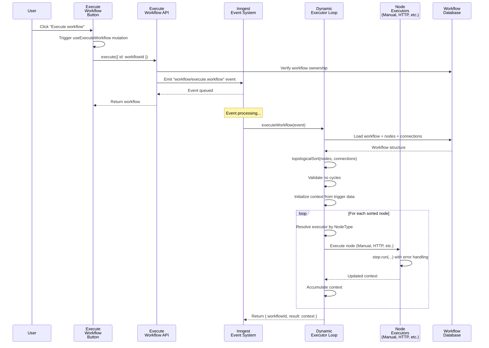

```mermaid
sequenceDiagram
participant User as User
participant Button as Execute<br/>Workflow<br/>Button
participant API as Execute<br/>Workflow API
participant Inngest as Inngest<br/>Event System
participant Executor as Dynamic<br/>Executor Loop
participant NodeExec as Node<br/>Executors<br/>(Manual, HTTP, etc.)
participant DB as Workflow<br/>Database

    User->>Button: Click "Execute workflow"
    Button->>Button: Trigger useExecuteWorkflow mutation
    Button->>API: execute({ id: workflowId })

    API->>DB: Verify workflow ownership
    API->>Inngest: Emit "workflow/execute.workflow" event
    Inngest-->>API: Event queued
    API-->>Button: Return workflow

    Note over Inngest: Event processing...

    Inngest->>Executor: executeWorkflow(event)
    Executor->>DB: Load workflow + nodes + connections
    DB-->>Executor: Workflow structure

    Executor->>Executor: topologicalSort(nodes, connections)
    Executor->>Executor: Validate no cycles

    Executor->>Executor: Initialize context from trigger data

    loop For each sorted node
        Executor->>Executor: Resolve executor by NodeType
        Executor->>NodeExec: Execute node (Manual, HTTP, etc.)
        NodeExec->>NodeExec: step.run(...) with error handling
        NodeExec-->>Executor: Updated context
        Executor->>Executor: Accumulate context
    end

    Executor-->>Inngest: Return { workflowId, result: context }
```
